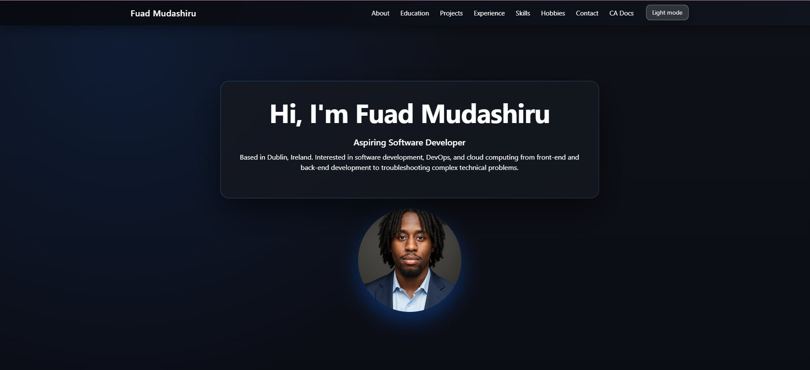

# Fuad Mudashiru | Portfolio

Personal portfolio built with HTML, CSS, JavaScript, and Bootstrap 5.3. It highlights education, projects, experience, skills, hobbies, and contact info, with dark/light theme toggle and smooth in-page navigation.

## Features
- Responsive layout with Bootstrap 5.3 and offcanvas mobile nav
- Dark/light mode toggle with preference saved to localStorage (defaults to dark)
- Smooth scroll + scrollspy; back-to-top button
- Animated skill bars when the section enters view
- Accessible modals, accordions, and nav (ARIA labels, keyboard friendly)
- Sections: Hero, About, Education, Projects, Experience, Skills, Hobbies, Contact

## Tech Stack
- HTML5, CSS3, JavaScript (vanilla)
- Bootstrap 5.3 (CSS/JS) + Bootstrap Icons
- No build step or backend

## Theme Toggle
- Default: dark mode on first load.
- Preference stored in `localStorage` under `fm-portfolio-theme`.
- Toggle button switches themes and updates the stored preference.

## Accessibility Notes
- Nav links, buttons, and modals include appropriate ARIA labels/roles.
- Offcanvas nav closes on link click to keep focus behavior clean on mobile.
- Skill bars use `role="progressbar"` on the inner bar; outer wrapper is `aria-hidden` to avoid double announcements.

## Deployment
- Live: https://yonko-smurk.github.io/fuad-porfolio/#hero
- Static site; host on GitHub Pages, Netlify, Vercel, or any static host.
- Ensure `index.html`, `style.css`, `script.js`, and image assets are in the published directory.

## License
TU Dublin .

